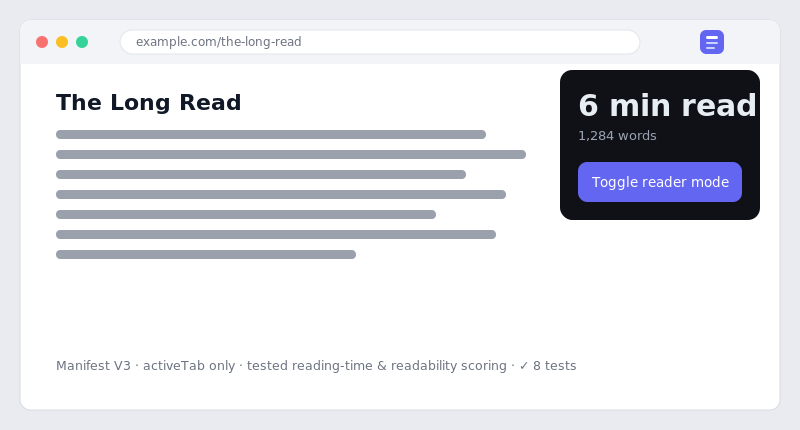

# Quiet Reader — browser extension

[](https://github.com/JCreatesGH/reader-extension/actions)
[](https://developer.chrome.com/docs/extensions/mv3/intro/)
[](LICENSE)

A small **Manifest V3** browser extension that shows the reading time for any article and toggles a one-click, distraction-free reader mode. Privacy-friendly: `activeTab` only, no tracking, no network calls.



## Features

- ⏱️ **Reading time** computed from the article's main content (not the whole page chrome).
- 🧘 **Reader mode** — hides everything except the article body, widens the column, bumps the type.
- 🧠 **Readability scoring** — picks the real content block by length, sentence density, and link density.
- 🔒 Minimal permissions, MV3, TypeScript.

## Install (developer mode)

```bash
npm install
npm run build        # compiles src -> dist
```

Then in Chrome/Edge: `chrome://extensions` → enable **Developer mode** → **Load unpacked** → select this folder. `npm run zip` produces a store-ready archive.

## How it works

- `src/reading.ts` — pure functions: `readingTime`, `countWords`, `extractText`, `scoreBlock`. Fully unit-tested, no browser APIs.
- `src/content.ts` — finds the best content block on the page and responds to popup messages.
- `src/popup.ts` + `popup.html` — the toolbar UI; `reader.css` powers the reader view.

## Development

```bash
npm test          # 8 tests
npm run build     # tsc, clean
```

## License

MIT
